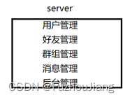
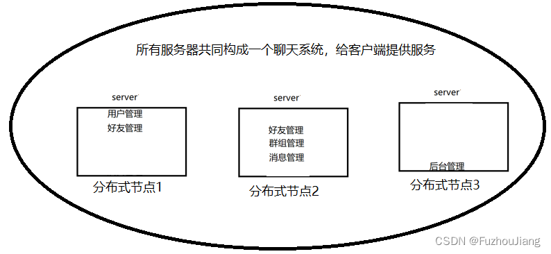

## 分布式网络通信框架（一）——集群和分布式

## 单机聊天服务器

**缺点**：

受限于硬件资源，服务器所能承受的**用户并发量**不够大；

任意模块**修改**，都会导致整个项目代码重新**编译、部署**；

系统中，有些模块是**CPU**密集型，有些是**IO**密集型，造成各模块对硬件资源的需求是不一样的

## 集群聊天服务器

**优点**：用户**并发量**提升了，部署简单

**缺点**：修改模块项目代码还是要**重新编译**，而且要进行多次编译

比如后台管理不需要高并发，所以不需要每台机器都部署

## 分布式

一个工程**拆分了很多模块**，每一个模块独立部署运行在一个服务器主机上，所有服务器协同工作共同提供服务，每一台服务器称作分布式的一个**节点**，根据节点的并发要求，对一个节点可以再做**节点模块集群部署，比如下图分布式节点**1可以再集群部署出分布式节点1-1，分布式节点1-2，…

## 问题

大系统的软件模块怎么划分？各模块可能会实现大量重复的代码

各模块都运行在不同的进程里（如`docker`虚拟化环境中），各模块之间该怎么访问呢？

机器1上的模块怎么调用机器2上的模块的一个业务方法？

机器1上的一个模块进程1怎么调用机器1上的模块进程2里面的一个业务方法呢？

### 解答：这就是本项目要实现的分布式网络通信框架的作用！让具体的远程函数调用透明化